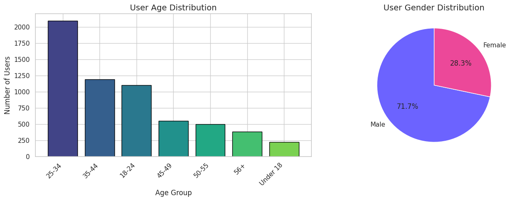
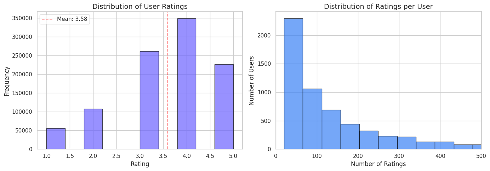
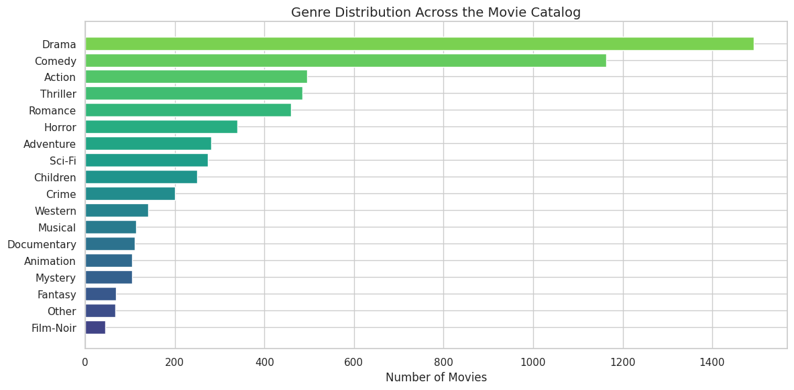
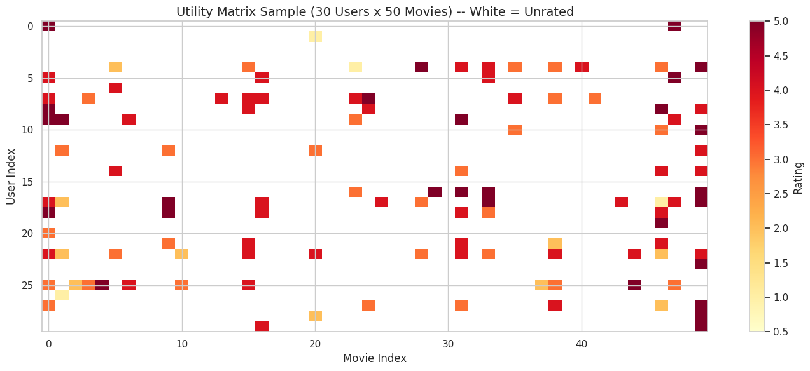
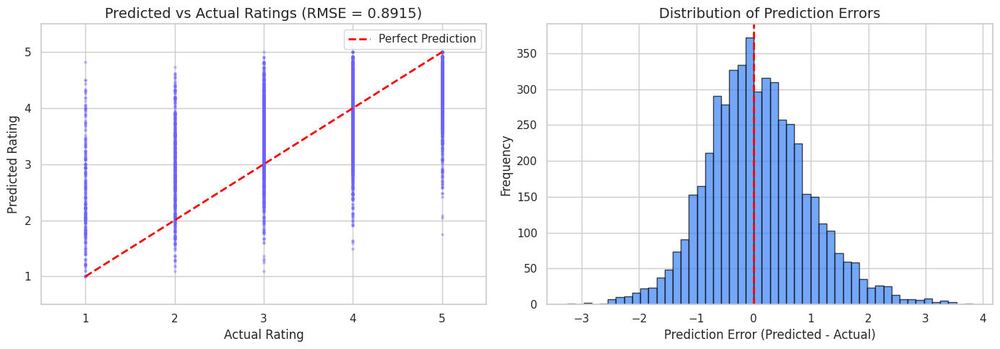
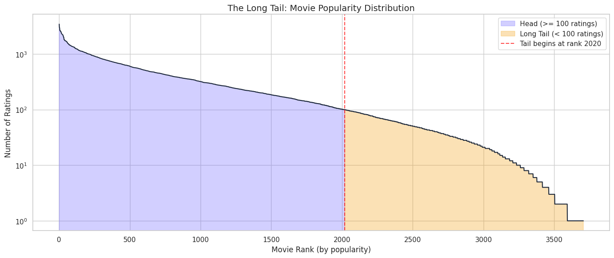

# Cinema Discovery Engine

**A Hybrid Movie Recommendation System built for CSE488: Big Data Analytics.**

## 📌 Description

The **Cinema Discovery Engine** is a comprehensive, academic-grade Recommender System designed to address core challenges in real-world recommendation engines: **Data Abundance**, **Matrix Sparsity**, and the **Cold Start Problem**. 

By combining **Item-Item Collaborative Filtering** (using Pearson Correlation) with **Content-Based Filtering** (using TF-IDF), this system provides highly personalized movie recommendations. It intelligently adapts to user data availability, seamlessly switching between strategies for new, sparse, and active users. The engine also features a mechanism to surface "Hidden Gems" from the Long Tail of the content catalog, promoting high-quality but lesser-known movies.

A fully interactive **Streamlit Dashboard** is included, allowing users to experience the recommendation pipeline firsthand, explore genre-based browsing, see personalized suggestions with explainability, and view system analytics.

## ✨ Key Features

*   **Hybrid Recommendation Strategy**: Automatically switches between Content-Based and Collaborative Filtering depending on the user's interaction history.
*   **Item-Item Collaborative Filtering**: Predicts ratings using a weighted average based on Pearson Correlation (computed via cosine similarity on centered data to remove user bias).
*   **Content-Based Cold Start Solution**: Recommends movies to new users using Cosine Similarity on TF-IDF vectors of movie genres.
*   **Utility Matrix Handling**: Efficiently manages a sparse rating matrix (~95.5% sparsity) using `scipy.sparse`.
*   **Hidden Gems Discovery**: Identifies high-rated but rarely reviewed movies in the "Long Tail" to combat popularity bias.
*   **Interactive Dashboard**: A multi-tab Streamlit application providing personalized recommendations with "Why this movie?" explainability, content-based exploration, and live analytics.
*   **Academic Rigor**: Evaluated using Root-Mean-Square Error (RMSE) on a 20% held-out test set, with detailed mathematical formulas throughout the notebook.

## 📊 Visualizations & Analytics

Here are some of the key insights and plots generated by the engine:

### 1. User Demographics

*Distribution of users by age bucket and gender.*

### 2. Rating & Genre Distribution

*Overall distribution of ratings and number of ratings per user.*


*Frequency of different genres across the movie catalog.*

### 3. Utility Matrix Sparsity

*A sample of the sparse Utility Matrix, highlighting the challenge of unrated items (white spaces).*

### 4. Model Evaluation (RMSE)

*Scatter plot showing predicted vs. actual ratings, along with the distribution of prediction errors.*

### 5. The Long Tail Challenge

*Visualization of movie popularity, showing the "Head" (mainstream hits) vs. the "Long Tail" (niche content and Hidden Gems).*

## 🚀 Getting Started

### Running the Notebook

You can run the full pipeline in Google Colab or your local Jupyter environment:

1.  Open `notebook/Cinema_Discovery_Engine.ipynb`.
2.  Ensure the datasets are located in the `Data/` folder (or upload them when prompted in Colab).
3.  Run all cells to generate the model artifacts (`recommender_artifacts.pkl`) and the Streamlit app script (`app.py`).

### Running the Dashboard Locally

Once the notebook has generated `recommender_artifacts.pkl` and `app.py`:

```bash
pip install streamlit pandas numpy matplotlib
streamlit run app.py
```

### Running the Dashboard in Google Colab

Add and execute the following cell at the end of the notebook:

```python
!pip install streamlit -q
!npm install -g localtunnel

# Start Streamlit in the background
!streamlit run app.py --server.port 8501 &>/content/logs.txt &
import time
time.sleep(3)

# Create a public tunnel
!npx localtunnel --port 8501
```
*(When accessing the localtunnel URL, provide the Colab instance's external IP if prompted).*

## 📂 Repository Structure

*   `notebook/Cinema_Discovery_Engine.ipynb`: The main executed notebook containing the full pipeline, evaluation, and dashboard generation code.
*   `Data/`: Contains the datasets used by the engine.
*   `assets/`: Contains extracted plots and images used in this README.

## 📚 References & Dataset Citation

### Primary Implementation Dataset
This project uses a derivative dataset that has been cleaned and enriched with TMDB poster links specifically for implementation in dashboards.

*   **Dataset Name:** MovieLens 1M with Posters & Metadata
*   **Author:** Mohamed Elmallah
*   **Source Link:** [Kaggle Dataset](https://www.kaggle.com/datasets/mohamedelmallah1/movielens-1m-with-posters-and-metadata)
*   **Files Utilized:** `movies.csv`, `ratings.csv`, and `users.csv`.

### Original Source Citation (For Academic Completeness)
Since the Kaggle dataset is a derivative of the original research data, we acknowledge the authors who originally collected the 1 million ratings.

*   **Research Paper:** F. Maxwell Harper and Joseph A. Konstan. 2015. The MovieLens Datasets: History and Context. *ACM Transactions on Interactive Intelligent Systems (TiiS)* 5, 4, Article 19.
*   **Original Research Link:** [GroupLens](https://grouplens.org/datasets/movielens/1m/)

## 🧑‍💻 Author

**Md. Sadik Shahriar**
ID: 2023-2-60-103
Course: CSE488 - Big Data Analytics
